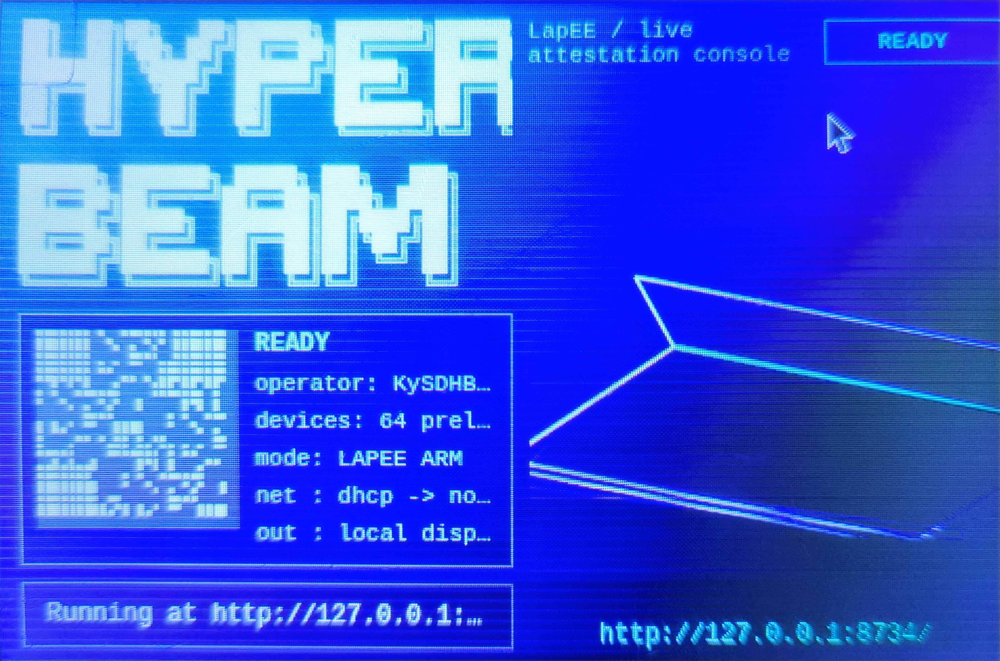

# LapEE ARM Port for Raspberry Pi 4

This directory is the Raspberry Pi OS / Raspbian ARM64 port layer for the
imported LapEE project in `../upstream-lapee`.

The upstream project builds a full x86_64 UEFI laptop appliance image with
Buildroot, Secure Boot, TPM 2.0 measured boot, and a signed UKI at
`EFI/Boot/BootX64.efi`. A Raspberry Pi 4 running Raspberry Pi OS is a different
target:

- CPU: ARM64, not x86_64.
- Boot path: Raspberry Pi firmware, not PC UEFI by default.
- Runtime OS: Debian/Raspberry Pi OS packages, not Buildroot initramfs.
- TPM/TME: no built-in PC TPM or Intel TME/AMD SME. A discrete TPM HAT can be
  added later, but the default Pi 4 path is a non-attested HyperBEAM node.

So this port does not claim LapEE-equivalent attestation. It rebuilds the
LapEE-flavored HyperBEAM runtime natively on ARM64, stages the LapEE overlay,
and runs it as a systemd service on Raspberry Pi OS.

## Running Alpha Build

Example of a running ALPHA LapEE build on Raspberry Pi 4 ARM:



## Layout

```text
ARM/
  Makefile
  config/lapee-arm.json
  display/Example_Pi_4.jpg
  display/index.html
  scripts/install-deps.sh
  scripts/build-hyperbeam.sh
  scripts/run-hyperbeam.sh
  scripts/run-display.sh
  scripts/install-service.sh
  systemd/lapee-hyperbeam.service
```

Build output goes under `ARM/build/` and installed runtime files go under:

```text
/opt/lapee-arm/hyperbeam
/etc/lapee-arm/lapee-arm.json
```

The `Secureboot-TPM` branch also includes the first Raspberry Pi image-builder
path under `ARM/image/`.

## Quick Start on Raspberry Pi OS 64-bit

Run these commands on the Pi:

```sh
cd /path/to/Lapee-ARM/ARM
make deps
make build
sudo make install
sudo make start
```

Then check:

```sh
systemctl status lapee-hyperbeam
make smoke
```

For manual checks, use `OPTIONS /~meta@1.0/info` only as a cheap server-alive
probe. Use `GET /~system@1.0/info` or `GET /~system@1.0/all` to verify real
HyperBEAM device dispatch:

```sh
curl -i -X OPTIONS http://127.0.0.1:8734/~meta@1.0/info
curl -i -H 'accept: application/json' -H 'accept-bundle: true' \
  http://127.0.0.1:8734/~system@1.0/info
curl -i -H 'accept: application/json' -H 'accept-bundle: true' \
  http://127.0.0.1:8734/~system@1.0/all
```

`GET /~meta@1.0/info` can currently fail on ARM with a lazy-link cache
serialization error even while the node is alive and other device GETs work.

The optional local display uses a browser kiosk page with the LapEE console
look, instead of the upstream appliance TTY renderer. Start it manually only
after verifying the node:

```sh
make display
```

This port intentionally does not enable HyperBEAM at boot. Use `make run` while
debugging, or `sudo make start` after the Pi has booted when you want the node
in the background.

Once the node/display path is verified, start the full local LapEE ARM instance
manually with:

```sh
sudo make start-node
```

If you have no TPM, TPM endpoints are expected to be unavailable or degraded.
The service sets `LAPEE_TPM_ALLOW_NO_NIF=1` so the overlay can load for
development and non-attested operation.

Unlike the upstream appliance config, the ARM config does not run
`measurement@1.0/boot` as a startup hook. A stock Raspberry Pi 4 has no supported
TPM/SNP measurement device, so requiring that hook would stop the node during
startup.

## Image Builder

On the `Secureboot-TPM` branch, package the working runtime and inject it into a
Raspberry Pi OS arm64 base image:

```sh
cd /path/to/Lapee-ARM/ARM
make deps
make build
make runtime-tarball
sudo make image-deps
sudo make image BASE_IMAGE=/path/to/raspios-arm64.img
```

The image output defaults to:

```text
ARM/build/images/lapee-arm-pi-alpha.img
ARM/build/images/lapee-arm-pi-alpha.img.sha256
```

After flashing and booting that image:

```sh
lapee-arm-start-node
lapee-arm-smoke
lapee-arm-stop
```

This image builder is the staging step for secure boot and TPM work. It does not
yet make a Raspberry Pi secure-boot/TPM attestation claim by itself.

## Build Notes

The build script:

1. Clones pinned HyperBEAM from `https://github.com/permaweb/HyperBEAM`.
2. Checks out the same `HYPERBEAM_VERSION` used by upstream LapEE.
3. Stages `../upstream-lapee/hyperbeam-overlay` into the checkout.
4. Builds `./rebar3 as lapee release` natively for ARM64.

Current LapEE Permagit import:

```text
9f4b0bf709f9e5827f5b45c4d0ca0ca1060e44aa
```

Current HyperBEAM GitHub commit pin, read from
`../upstream-lapee/buildroot-external/package/hyperbeam/hyperbeam.mk`:

```text
c1c07345a9a9f20c1489e7c977098f3fe4054c5c
```

If the Pi has limited RAM, add swap before building. HyperBEAM and native NIF
dependencies are not tiny.

On 32-bit Raspberry Pi OS, Cargo/Rust failures are the most likely blocker.
The build script disables the SEV-SNP Rust NIF by default with
`LAPEE_ARM_STUB_SNP_NIF=1`, because a stock Pi cannot provide AMD SEV-SNP
hardware anyway. It also uses one Cargo job by default and prefers the system
`/usr/bin/cargo`. Current HyperBEAM dependencies require `rustc >= 1.91`. If
Debian's packaged Rust is too old, install rustup and opt into it explicitly:

```sh
curl --proto '=https' --tlsv1.2 -sSf https://sh.rustup.rs | sh -s -- -y
. "$HOME/.cargo/env"
rustup default stable
LAPEE_ARM_USE_RUSTUP=1 make build
```

## Attestation Status

This first ARM port is "LapEE-inspired", not a replacement for the x86 laptop
image. Preserved:

- LapEE HyperBEAM overlay modules.
- `system@1.0` machine-report surface.
- `green-zone@1.0` and related overlay code where it does not require unavailable
  hardware.
- The operator config layering model through `HB_CONFIG`.

Changed:

- No UKI, Secure Boot enrollment, PCR-15 measured boot, or TME/SME gate.
- No USB image builder yet.
- No default TPM-backed boot attestation on a stock Pi 4.

Next useful work is a Pi image-builder path that starts from Raspberry Pi OS
Lite arm64, installs this runtime into the root filesystem, and optionally
supports a TPM HAT with `LAPEE_TPM_TCTI=device:/dev/tpm0`.

Secure Boot / TPM work lives on the `Secureboot-TPM` branch. See
`ARM/docs/secureboot-tpm-plan.md` there for the Pi-specific attestation plan.
